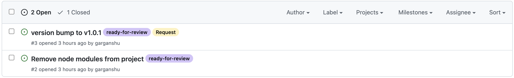
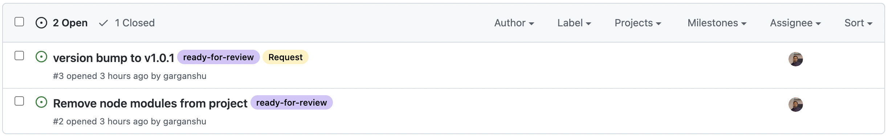
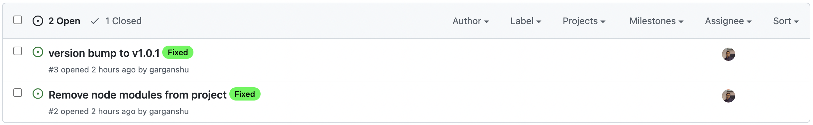
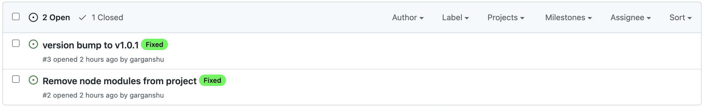

<a href="https://www.buymeacoffee.com/garganshu" target="_blank"></a>


<a href="https://github.com/garganshu/github-assignee-updater/releases"></a>
[](https://github.com/marketplace/actions/github-assignee-updater)

# Github Assignee Updater

Updating assignees made easy in your workflow using Github Assignee Updater :white_check_mark:


Why is this plugin in action? :gem:
----

* Improves the developer productivity to auto update assignees :child:

* Configurable action and helps to automate the workflow :hammer:

* Effective CI/CD pipelines :white_check_mark:

How to use
----

1. Re-assign Issues to User(s)

```
filter-labels: ready-for-review
update-assignees: username
```
        
 Before |  After
-------- | ---
 | 

2. Clear Assignees from Issues

```
filter-labels: ready-for-review
clear-assignees: true
```
        
 Before |  After
-------- | ---
 | 


Inputs
------

### `owner`

**Required** <br />
Owner of Organization or Repository

### `repo`

**Required** <br />
Repository name

### `token`

**Required** <br />
Github access token

### `filter-labels`

Filter issues which contains all labels eg. label1,label2 <br />
Default - fetches all issues

### `clear-assignees`

Remove all assignees from issues eg. true/false <br />
Default - false

### `update-assignees`

Update existing assignees with new assignees eg. username,username1

## Sample usage

```
name: Update Issues Assignee

on: [push]

jobs:
  build:

    runs-on: ubuntu-latest

    steps:
    - name: update assignees
      id: updater
      uses: garganshu/github-assignee-updater@v1.0.0
      with:
        owner: ${{secrets.OWNER}}
        repo: ${{secrets.REPO}}
        token: ${{secrets.TOKEN}}
        filter-labels: ready-for-review
        clear-assignees: false
        update-assignees: username

```

Projects using Github Label Updater? 🚀
----

### `Frontier` - Your Front Seat to Crypto and DeFi (<a href="https://frontier.xyz/" target="_blank">frontier.xyz</a>)

